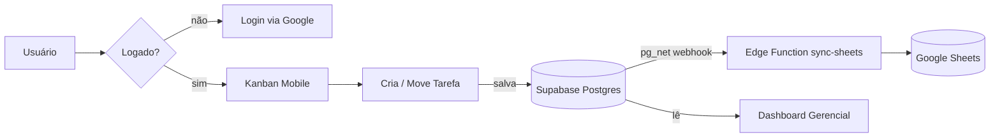

# Quadro — Gestão de Atividades · CO-FZ

> Kanban interativo e mobile-first para as Divisões Técnica e Administrativa da **Comissão de Obras de Fortaleza**. Registro diário de atividades, dashboard gerencial e sincronização automática com Google Sheets.

---

## Visão geral

| Camada | Tecnologia |
|--------|-----------|
| Framework | Next.js 16.2 (App Router) |
| Linguagem | TypeScript 5 (strict) |
| Estilo | Tailwind CSS v4 (`@theme` em `globals.css`) |
| Backend | Supabase (Postgres, Auth, Storage, Edge Functions) |
| Autenticação | Google OAuth via Supabase Auth |
| Drag-and-drop | dnd-kit |
| Integração | Google Sheets (via Edge Function + `pg_net`) |
| Deploy | Vercel |

---

## Funcionalidades

- **Autenticação via Google** — Login com o Gmail da equipe; perfil sincronizado automaticamente (nome real, avatar).
- **Kanban Mobile-first** — Colunas A Fazer · Em Andamento · Concluída · Arquivada com drag-and-drop e criação/edição de tarefas em modal.
- **Dashboard Gerencial** — Visão de produtividade por membro; contadores de tarefas ativas, concluídas e totais.
- **Perfil Individual** — Página de atividades alocadas por usuário.
- **Sincronização Google Sheets** — Webhook Postgres (`pg_net`) dispara a Edge Function `sync-sheets` a cada inserção ou atualização de tarefa; planilha sempre espelhada.
- **Sistema de Notificações (Toast)** — Feedback visual global para todas as ações do usuário.
- **Controle de Acesso** — Roles: `admin`, `coordenador`, `efetivo`; políticas RLS no banco.

---

## Pré-requisitos

- Node.js ≥ 20
- pnpm ≥ 9
- Supabase CLI (`pnpm add -g supabase`)
- Conta Supabase com projeto criado
- Google Cloud Project com OAuth 2.0 configurado
- (Opcional) Conta de serviço Google com acesso à planilha para o sync

---

## Configuração local

### 1. Clone e instale as dependências

```bash
git clone git@github.com:CO-FZ/quadro.git
cd quadro
pnpm install
```

### 2. Variáveis de ambiente

Copie o arquivo de exemplo e preencha com as suas credenciais:

```bash
cp .env.local.example .env.local
```

| Variável | Descrição |
|----------|-----------|
| `NEXT_PUBLIC_SUPABASE_URL` | URL do projeto Supabase |
| `NEXT_PUBLIC_SUPABASE_ANON_KEY` | Chave anônima pública do Supabase |

> **Nunca** comite `.env.local`. Ele já está no `.gitignore`.

### 3. Aplique as migrations no banco

```bash
supabase link --project-ref <PROJECT_REF>
supabase db push
```

### 4. Configure os secrets para a Edge Function (sync)

```bash
supabase secrets set GOOGLE_SERVICE_ACCOUNT_JSON='<JSON_DA_CONTA_DE_SERVICO>'
supabase secrets set GOOGLE_SHEET_ID='<ID_DA_PLANILHA>'
```

### 5. Deploy da Edge Function

```bash
supabase functions deploy sync-sheets
```

### 6. Inicie o servidor de desenvolvimento

```bash
pnpm dev
```

Abra [http://localhost:3000](http://localhost:3000) no navegador.

---

## Scripts disponíveis

| Comando | Descrição |
|---------|-----------|
| `pnpm dev` | Servidor de desenvolvimento com hot-reload |
| `pnpm build` | Build de produção |
| `pnpm start` | Inicia o build de produção |
| `pnpm lint` | Análise estática com ESLint |

---

## Estrutura do projeto

```
quadro/
├── app/
│   ├── (app)/            # Rotas autenticadas
│   │   ├── dashboard/    # Dashboard gerencial
│   │   ├── kanban/       # Board principal
│   │   ├── admin/        # Painel de administração
│   │   └── profile/      # Perfil do usuário
│   ├── (marketing)/      # Rotas públicas (landing)
│   └── auth/             # Callbacks de autenticação
├── components/
│   ├── ui/               # Primitivos de design system
│   └── features/         # Componentes de domínio
├── lib/
│   ├── auth/             # Helpers de autenticação
│   ├── db/               # Clientes Supabase
│   └── utils/            # Utilitários gerais
├── supabase/
│   ├── functions/        # Edge Functions (Deno)
│   │   └── sync-sheets/  # Sincronização Google Sheets
│   └── migrations/       # Migrations SQL versionadas
└── docs/
    ├── prd/              # Product Requirements Document
    ├── spec/             # Tech Specs e ADRs
    └── sprints/          # Histórico de sprints
```

---

## Arquitetura de dados



---

## Banco de dados

As migrations estão em `supabase/migrations/` e são versionadas cronologicamente:

| Migration | Conteúdo |
|-----------|----------|
| `20260506000000` | Gestão de usuários e perfis |
| `20260506000001` | Gestão de tarefas e atribuições |
| `20260506000002` | Status `ARCHIVED` |
| `20260507000000` | Sync de metadados do Google (nome, avatar) |
| `20260507000005` | Webhook para Google Sheets via `pg_net` |

---

## Contribuição

Este repositório segue as regras definidas em [`AGENTS.md`](./AGENTS.md). Em resumo:

1. **Planeje** antes de modificar: liste os arquivos afetados em um Plan Artifact.
2. **Valide** antes de abrir PR: `pnpm typecheck && pnpm lint`.
3. **Commits** seguem [Conventional Commits](https://www.conventionalcommits.org/) (`feat:`, `fix:`, `chore:`, `refactor:` …).
4. **Nunca** faça `git push` sem aprovação humana.
5. **Nunca** comite secrets ou valores reais em `.env`.

---

## Licença

Uso interno — Comissão de Obras de Fortaleza (CO-FZ). Todos os direitos reservados.
