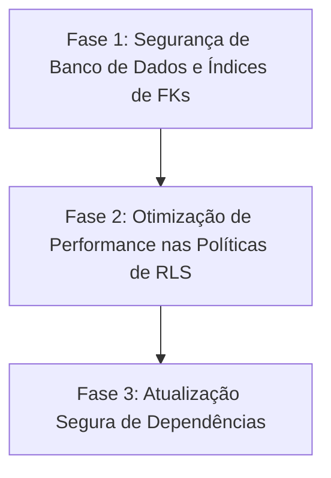

# Relatório de Averiguação de Dívida Técnica (Technical Debt Audit) — 2026-05-18

> [!NOTE]
> Este relatório consolida a saúde da base de código do **Quadro** e adiciona uma análise profunda do banco de dados remanescente através dos linters do Supabase. O objetivo é fornecer uma visão holística e orientar as próximas implementações de estabilidade e segurança.

---

## 1. Sumário Executivo

A base de código local do **Quadro** encontra-se em excelente estado de conservação, com **zero warnings de lint**, **100% de sucesso nos testes unitários** e **zero tags temporárias** (`TODO`, `FIXME`, `HACK`). 

No entanto, a averiguação estendida no banco de dados (**Supabase**) revelou débitos técnicos significativos relacionados a **Segurança (Privilégios de Funções)** e **Performance (Falta de Índices e Otimização de RLS)**. Este documento mapeia estas pendências e fornece recomendações detalhadas para as próximas melhorias agênticas.

---

## 2. Código Local e Análise Estática

### 2.1 Marcadores de Débitos (TODOs, FIXMEs e HACKs)
Uma varredura completa por tags informais de pendência em arquivos de código fonte retornou **zero ocorrências**:
* A string `"HACKED"` existe apenas como dado de entrada legítimo em um teste de integração de tarefas ([tasks.actions.test.ts](file:///home/zelzin/study/quadro/tests/integration/actions/tasks.actions.test.ts)).
* Não existem blocos de código com lógica incompleta ou remendos estruturais temporários.

### 2.2 Conformidade do Linter (ESLint)
* **Status atual:** `pnpm lint` retorna **0 erros e 0 warnings**.
* **Melhorias recentes:** Variáveis não utilizadas em testes ([auth.spec.ts](file:///home/zelzin/study/quadro/tests/e2e/auth.spec.ts), [tasks.rls.test.ts](file:///home/zelzin/study/quadro/tests/integration/rls/tasks.rls.test.ts) e [use-cases.test.ts](file:///home/zelzin/study/quadro/tests/unit/src/modules/task-board/application/use-cases.test.ts)) foram removidas, e a pasta de cobertura `coverage/` foi adicionada com sucesso aos ignores globais no [eslint.config.mjs](file:///home/zelzin/study/quadro/eslint.config.mjs).

### 2.3 Compilação e Tipagem (TypeScript)
* Executado `pnpm typecheck` com sucesso.
* `"strict": true` está configurado e sendo rigorosamente respeitado sem nenhuma violação ou uso implícito de `any` no código do projeto.

---

## 3. Cobertura e Execução de Testes Unitários

Executamos a suíte de testes unitários com `pnpm test:unit`:
* **Resultado:** **92/92 testes passaram com sucesso** em 8 arquivos diferentes.
* **Componentes Testados:**
  * Lógica de Domínio de Tarefas ([task.test.ts](file:///home/zelzin/study/quadro/tests/unit/src/modules/task-board/domain/task.test.ts))
  * Casos de Uso da Aplicação ([use-cases.test.ts](file:///home/zelzin/study/quadro/tests/unit/src/modules/task-board/application/use-cases.test.ts))
  * Utilitários do Logger ([index.test.ts](file:///home/zelzin/study/quadro/tests/unit/lib/logger/index.test.ts))
  * Internacionalização ([index.test.ts](file:///home/zelzin/study/quadro/tests/unit/lib/i18n/index.test.ts))
  * Guardas de Roles ([require-role.test.ts](file:///home/zelzin/study/quadro/tests/unit/lib/auth/require-role.test.ts))

---

## 4. Dívida Técnica de Banco de Dados (Supabase Linter)

> [!IMPORTANT]
> A averiguação remota no projeto Supabase ativo (`yanveevgpfjopcjnosqq`) identificou pontos de atenção críticos para a segurança e a escalabilidade. Eles representam a verdadeira dívida técnica a ser mitigada em sprints subsequentes.

### 4.1 Vulnerabilidades de Segurança (Security Linter)

| Função Flagged | Problema Identificado | Ação Corretiva Recomendada |
| :--- | :--- | :--- |
| `public.handle_task_sync` | Possui um `search_path` mutável, o que permite ataques de sequestro de caminho por usuários mal-intencionados. | Declarar explicitamente `SET search_path = public` na definição da função. |
| `public.check_whitelist` `public.handle_new_user` `public.handle_task_sync` `public.is_admin` `public.sync_google_metadata` | São funções configuradas como `SECURITY DEFINER` (executadas com privilégios de superusuário), mas estão expostas no schema público e podem ser invocadas diretamente via PostgREST/RPC pelas roles `anon` e `authenticated`. | 1. Avaliar se a função realmente precisa ser `SECURITY DEFINER` (se sim, revogar acesso público com `REVOKE EXECUTE ON FUNCTION... FROM public, anon, authenticated`). 2. Se não precisar, alterá-la para `SECURITY INVOKER`. |
| **Auth** | Proteção contra senhas vazadas desabilitada. | Ativar a verificação de segurança integrada do Supabase Auth que impede senhas comprometidas (via HaveIBeenPwned). |

### 4.2 Gargalos de Performance (Performance Linter)

#### A. Chaves Estrangeiras Sem Índices (`unindexed_foreign_keys`)
Consultas que realizam joins ou exclusões em cascata nessas tabelas causarão scans sequenciais (full table scan), degradando o desempenho à medida que os dados crescem.
* **Tabela:** `public.privileged_role_audit` -> FKey `privileged_role_audit_profile_id_fkey` (`profile_id`)
* **Tabela:** `public.privileged_role_audit` -> FKey `privileged_role_audit_whitelist_entry_id_fkey` (`whitelist_entry_id`)
* **Tabela:** `public.task_assignees` -> FKey `task_assignees_user_id_fkey` (`user_id`)
* **Tabela:** `public.tasks` -> FKey `tasks_created_by_fkey` (`created_by`)
* **Tabela:** `public.whitelist` -> FKey `whitelist_created_by_fkey` (`created_by`)

> [!TIP]
> **Solução:** Adicionar índices de cobertura para cada chave estrangeira acima listada nas próximas migrações.

#### B. Plano de Inicialização Ineficiente em Políticas RLS (`auth_rls_initplan`)
Políticas de RLS que usam chamadas diretas como `auth.uid()` ou outras funções do helper de auth são desnecessariamente reavaliadas para cada linha da tabela.
* **Políticas Afetadas:**
  * `public.profiles`: `"Users can view own profile"`
  * `public.tasks`: `"Atualização de tarefas baseada na role e alocação"`, `"Admins e Coordenadores podem deletar tarefas"`, `"Authenticated cria a própria tarefa"`
  * `public.task_assignees`: `"Admins e Coordenadores gerenciam alocações"`, `"Authenticated pode se auto-alocar"`, `"Criadores podem alocar usuários em suas tarefas"`
  * `public.privileged_role_audit`: `"Admins podem ler audit log"`

> [!TIP]
> **Solução:** Substituir chamadas de função diretas por subconsultas escalares. E.g., em vez de `auth.uid() = user_id`, usar `(SELECT auth.uid()) = user_id`. Isso força o planejador do Postgres a calcular a função de auth apenas uma vez por query.

#### C. Múltiplas Políticas Permissivas (`multiple_permissive_policies`)
A presença de múltiplas regras permissivas força a execução paralela de várias validações sobre a mesma operação, causando sobrecarga.
* **Tabela:** `public.profiles` tem múltiplas políticas de `SELECT` ativo para as roles `anon`, `authenticated`, `cli_login_postgres`, `dashboard_user` etc. (Políticas: `"Admins can view all profiles"` e `"Users can view own profile"`).
* **Tabela:** `public.task_assignees` tem múltiplas políticas de `INSERT` e `SELECT` ativo para a role `authenticated`.

---

## 5. Dívida de Dependências (Dependency Outdated Debt)

A verificação de pacotes obsoletos via `pnpm outdated` identificou as seguintes dependências elegíveis para atualização:

| Pacote | Versão Atual | Versão Mais Recente | Tipo | Impacto / Riscos de Upgrade |
| :--- | :---: | :---: | :---: | :--- |
| `next` | `16.2.4` | `16.2.6` | Minor | Baixo. Atualização de estabilidade no App Router. |
| `react` / `react-dom` | `19.2.4` | `19.2.6` | Minor | Baixo. Correções internas no React 19. |
| `@supabase/supabase-js` | `2.105.3` | `2.106.0` | Minor | Baixo. Atualizações de compatibilidade com a API cliente. |
| `tailwindcss` / `@tailwindcss/postcss`| `4.2.4` | `4.3.0` | Minor | Baixo. Melhorias de build e desempenho no Tailwind v4. |
| `@types/node` | `20.19.39` | `25.9.0` | Major | Médio. A mudança dos tipos globais do Node 20 para 25 pode quebrar algumas assinaturas estritas de build caso existam APIs obsoletas. |
| `eslint` | `9.39.4` | `10.4.0` | Major | Médio. Mudanças no ecossistema e parsing de regras estritas. Exige validação pós-upgrade para garantir que nenhuma nova regra introduza falsos positivos de build. |
| `typescript` | `5.9.3` | `6.0.3` | Major | Alto. Versão maior de TypeScript frequentemente introduz validações estritas de inferência de tipos. Pode requerer ajustes menores no código do modelo de domínio. |
| `@supabase/ssr` | `0.10.2` | `0.10.3` | Minor | Baixo. Correções no fluxo de cookies e refresh de sessões SSR. |
| `vitest` / `@vitest/coverage-v8` | `4.1.5` | `4.1.6` | Minor | Baixo. Correções de estabilidade no runner de testes. |

---

## 6. Roteiro e Priorização de Mitigação (Roadmap)

Propomos o seguinte plano de ação em 3 fases para o próximo agente de codificação:

1. **Fase 1: Hardening de Segurança (Alta Prioridade)**
   * Criar uma migração DDL para setar `search_path` em `handle_task_sync`.
   * Restringir permissões de execução pública (`REVOKE EXECUTE`) nas funções `SECURITY DEFINER` do schema `public`.
   * Habilitar no dashboard do Supabase a proteção de senhas vazadas.
   * Criar índices cobrindo as chaves estrangeiras (`FKeys`) indicadas para evitar full table scans.

2. **Fase 2: Otimização de RLS (Média Prioridade)**
   * Atualizar as políticas RLS para utilizar subconsultas `(SELECT auth.uid())` ou equivalentes, mitigando o problema do `auth_rls_initplan`.
   * Consolidar e simplificar as políticas permissivas duplicadas de `SELECT` e `INSERT` em perfis e alocações de tarefas.

3. **Fase 3: Atualizações de Dependências (Média/Baixa Prioridade)**
   * Atualizar sequencialmente os pacotes menores e patches (`next`, `react`, `@supabase/supabase-js`, `tailwindcss` etc.).
   * Atualizar de forma isolada os pacotes de build e compiladores (`typescript`, `eslint`, `@types/node`), rodando `pnpm build && pnpm typecheck && pnpm lint` a cada passo para mitigar quebras de compilação.
