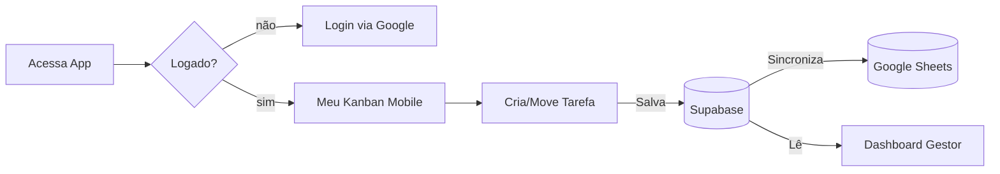

# PRD — quadro — v1.0

> Product Requirements Document. Único documento que define **o que** o produto faz e **para quem**.
> Não fala **como** (isso é a Tech Spec).

**Owner:** Eng Carlos Eduardo
**Eng lead:** Eng Carlos Eduardo
**Status:** `📝 draft`
**Última atualização:** 2026-05-06
**Discovery de origem:** `docs/discovery/00-discovery-brief.md`

---

## 1. TL;DR

> 5 linhas. Se um diretor lê só isso, precisa entender o produto.

```
O [quadro] resolve a [desorganização e perda de prazos de planilhas concorrentes] entregando um [Kanban interativo e dashboard mobile-first] para as [Divisões Técnica e Administrativa da Comissão de Obras de Fortaleza]. O sucesso será medido pela [adesão de 100% da equipe no registro diário de atividades], entregando a V1 hospedada na Vercel com banco Supabase.
```

---

## 2. Contexto e problema

> Cole/resuma da fase de discovery. Não comece do zero.

```
Atualmente as pessoas precisam preencher suas atividades diariamente, mas o modelo atual de planilhas concorrentes gera perda de prazos e sobrecarga em determinados membros. Ao final da semana, a gestão precisa avaliar as conclusões e reequilibrar demandas.
```

**Por que agora:**

```
A equipe perde prazos e não há visibilidade clara para redistribuir atividades ociosas, gerando gargalos na Comissão de Obras de Fortaleza.
```

---

## 3. Personas

| Persona | Cenário típico | Necessidade primária |
|---------|----------------|----------------------|
| Membro da Equipe (DT/DA) | Registrando atividades diárias pelo celular no canteiro/escritório | Interface rápida, fluida e mobile-first para preencher o que fez, o que falta fazer e atualizar status. |
| Gestor (Eng Carlos Eduardo) | Avaliando o progresso no final da semana | Visão unificada (Dashboard) para ver quem está sobrecarregado, quem concluiu e para quem delegar mais tarefas. |

---

## 4. Escopo

### 4.1 Em escopo (v1)

- ✅ Autenticação via Google (Gmail da equipe) usando Supabase Auth.
- ✅ Interface Mobile-first para registro diário rápido e fluido das atividades (Kanban).
- ✅ Dashboard analítico com visão gerencial (atividades por membro, concluídas vs. andamento).
- ✅ Sincronização automática dos dados com uma planilha do Google Sheets configurada no app.

### 4.2 Fora de escopo (v1)

- ❌ Não irá calcular folha de pagamento.
- ❌ Não irá controlar estoques ou materiais de obras.
- ❌ Sistemas de autenticação corporativos complexos fora do Gmail da equipe.

### 4.3 Roadmap pós-v1 (não compromissivo)

- 🔜 Alertas/notificações automáticas para atividades atrasadas.
- 🔜 Exportação de relatórios customizados em PDF.

---

## 5. User Stories

> Formato curto e numerado. Cada story vira uma branch/PR ou um conjunto de PRs.

| ID | Story | Persona | Prioridade |
|----|-------|---------|------------|
| US-01 | Como `Membro da Equipe`, quero `fazer login com meu Gmail`, para `ter acesso ao sistema rapidamente`. | `Membro` | P0 |
| US-02 | Como `Membro da Equipe`, quero `visualizar minhas tarefas em um Kanban pelo celular`, para `saber o que preciso fazer hoje`. | `Membro` | P0 |
| US-03 | Como `Membro da Equipe`, quero `criar e atualizar o status das minhas atividades (pendente, em andamento, concluído) com poucos cliques`, para `gastar o mínimo de tempo possível no celular`. | `Membro` | P0 |
| US-04 | Como `Gestor`, quero `ver um Dashboard de produtividade da equipe`, para `saber quem concluiu o quê e quem tem capacidade ociosa`. | `Gestor` | P0 |
| US-05 | Como `Gestor`, quero `que os dados do sistema sejam sincronizados para uma planilha do Google Sheets`, para `ter uma base espelho acessível para relatórios extras`. | `Gestor` | P1 |

**Legenda:** P0 = bloqueador de launch · P1 = importante · P2 = nice to have

---

## 6. Critérios de aceite (por story)

### US-01 (Login Gmail)

**Dado** que o usuário está na tela inicial
**Quando** ele clica em "Entrar com Google"
**Então** ele é autenticado via Supabase e redirecionado para a tela do Kanban/Dashboard.

E também:
- [ ] Caso de erro: Exibir "Não foi possível autenticar. Tente novamente." se houver falha de OAuth.
- [ ] Segurança: 🟡 (Depende de decisão) Restringir apenas aos emails da equipe cadastrada? Ou permitir qualquer Gmail?

### US-02 e US-03 (Kanban Mobile)

**Dado** que o usuário está logado e na página principal pelo celular
**Quando** ele arrasta ou clica num botão para mover a atividade de "Fazer" para "Andamento" ou "Concluído"
**Então** o sistema salva o status quase instantaneamente.

E também:
- [ ] Performance: Tempo de resposta para mover a tarefa deve ser mínimo (<200ms).
- [ ] Acessibilidade: Botões grandes o suficiente para toque na tela do celular.

### US-04 (Dashboard Gerencial)

**Dado** que o usuário tem perfil de gestor (ou acesso à tela do dashboard)
**Quando** ele acessa a aba "Dashboard"
**Então** ele visualiza gráficos ou métricas resumidas (Total concluídas, Ativas, Por Pessoa).

### US-05 (Sincronização Google Sheets)

**Dado** que o sistema recebe uma atualização/nova atividade no banco
**Quando** ela é salva no Supabase
**Então** um processo sincroniza essa respectiva linha na Planilha Google (inserindo ou atualizando).

---

## 7. Requisitos não-funcionais

| Categoria | Requisito |
|-----------|-----------|
| Performance | LCP < 2.5s p75; INP < 200ms p75 |
| Usabilidade | Foco total em Mobile-first. Ações devem exigir o mínimo de cliques. |
| Arquitetura | Next.js 16 (App Router), Tailwind v4, TypeScript |
| Backend | Hospedagem na Vercel; Banco/Auth no Supabase |
| Segurança | Autenticação Google via Supabase OAuth |
| Integrações | Comunicação com a API do Google Sheets |

---

## 8. Fluxos principais



---

## 9. Telas e estados

### Tela: Login
- **Propósito:** Entrada segura no sistema
- **Componentes:** Botão "Entrar com Google"
- **Estados:** default, loading, erro

### Tela: Meu Kanban (Visão Mobile)
- **Propósito:** Registro e movimentação de atividades diárias
- **Componentes:** Colunas (A Fazer, Fazendo, Concluído), Cartões de tarefa, Botão de Adicionar
- **Estados:** loading, vazio (sem tarefas), erro

### Tela: Dashboard
- **Propósito:** Visão da distribuição de tarefas da equipe
- **Componentes:** Contadores por membro, Cards de progresso geral
- **Estados:** loading, erro

---

## 10. Dados e privacidade

| Dado | Sensibilidade | Coleta | Retenção | Acesso |
|------|---------------|--------|----------|--------|
| Email/Nome | PII | Login (Google) | Até deleção | equipe |
| Tarefas/Atividades | Interno | Manual | Histórico | equipe |

---

## 11. Métricas de sucesso

| Tipo | Métrica | Meta v1 | Como medir |
|------|---------|---------|------------|
| North Star | Adesão diária | 100% da equipe reportando | Usuários ativos diários |
| Qualidade | Tempo de Sync | < 5s de atraso pro Sheets | Logs / Verificação manual |

---

## 12. Riscos & mitigação

| Risco | Probabilidade | Impacto | Mitigação |
|-------|---------------|---------|-----------|
| Falha no Sync com Google Sheets | Média | Médio | Usar rotas assíncronas sólidas e registrar logs claros de falha para tentar novamente. |
| Rejeição de UX Mobile | Média | Alto | Design premium e simplificado. Usaremos shadcn/ui e tailwind. |

---

## 13. Plano de lançamento

- **GA (Lançamento Geral):** A definir.

---

## 14. Aprovações

| Papel | Pessoa | Status |
|-------|--------|--------|
| Sponsor / PM | Eng Carlos Eduardo | ⬜ |
| Eng lead | Eng Carlos Eduardo | ⬜ |
