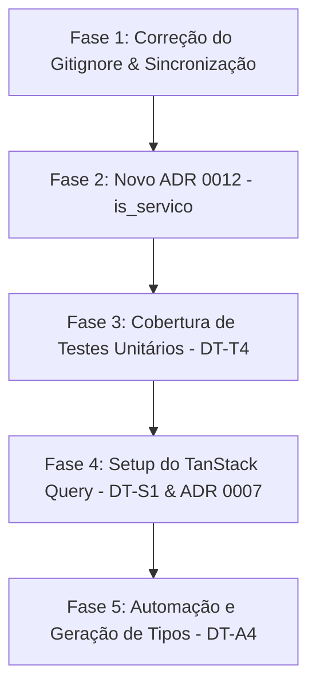

# Plano de Implementação — Resolução de Dívidas Técnicas e ADRs

Este plano detalha as ações necessárias para sanar as pendências identificadas na auditoria de ADRs (`adr_audit_inconsistencias.md`) e de dívidas técnicas (`technical_debt_audit.md`), focando principalmente nas pendências ativas da **Sprint 10** e consolidando a qualidade técnica do projeto **Quadro**.

---

## 📅 Visão Geral de Fases e Resoluções

---

## 🛠️ Detalhamento das Fases

### 📁 Fase 1: Ajuste Fino do `.gitignore` & Sincronização de Status (Concluído)

**Objetivo:** Permitir que o git rastreie a documentação interna do agente localizada em `.gemini/antigravity/skills/agent-product-harness/agent-product-harness/templates/docs/` sem rastrear o restante do cache, logs, brain e skills locais do Antigravity.

*   **Arquivos afetados:**
    *   [.gitignore](file:///home/zelzin/study/quadro/.gitignore)
*   **Implementação:**
    *   Utilização de regras de *unignore* recursivas (`!`) no `.gitignore` para abrir exceção cirúrgica na pasta de templates de documentação.
*   **Critério de Aceite:**
    *   `git status` detecta a pasta `.gemini/antigravity/skills/agent-product-harness/agent-product-harness/templates/docs/` e seu `.gitkeep` como arquivos não ignorados.
    *   Toda a pasta de skills locais `/skills/`, `.agents/`, `.codex` e outras pastas temporárias do agente continuam 100% ignoradas.

---

### 📝 Fase 2: Criação do ADR 0012 — Introdução do Campo `is_servico` (DT-A3)

**Objetivo:** Formalizar no registro de arquitetura a distinção de domínio entre "tarefa" e "serviço" de acordo com o PRD, documentando seu impacto em `user_task_stats` e as restrições impostas aos dados (título forçado a `"Serviço"`, descrição e links nulos).

*   **Arquivos afetados:**
    *   `docs/spec/adr/0012-introducao-tarefas-de-servico.md` *(novo)*
    *   [docs/adr/README.md](file:///home/zelzin/study/quadro/docs/adr/README.md) *(atualização do índice)*
*   **Estrutura do ADR 0012:**
    *   **Status:** `Aceito`
    *   **Contexto:** Explicação de que "serviços" (ex.: serviço de oficial de dia, escala de ronda) não representam progresso de desenvolvimento técnico, sendo atividades recorrentes com ciclo de vida e visualização simplificados.
    *   **Decisão:**
        *   Quando `is_servico: true`, o título deve ser normalizado rigidamente para `"Serviço"`.
        *   `description` e `drive_url` são higienizados para `null` via `normalizeTaskInput`.
        *   Estes itens são expressamente omitidos da agregação de métricas no view de banco de dados `user_task_stats` para evitar distorção de produtividade técnica do efetivo.
*   **Critério de Aceite:**
    *   ADR 0012 criado e linkado no README principal de ADRs.

---

### 🧪 Fase 3: Cobertura de Teste de Negócio para `is_servico` (DT-T4)

**Objetivo:** Garantir a consistência da regra de negócio de exclusão de tarefas de serviço dos cálculos de produtividade e estatísticas do painel.

*   **Arquivos afetados:**
    *   [tests/unit/src/modules/task-board/domain/task.test.ts](file:///home/zelzin/study/quadro/tests/unit/src/modules/task-board/domain/task.test.ts)
*   **Ações Técnicas:**
    *   Adicionar um describe block dedicado a testar a lógica do domínio associada ao `is_servico`.
    *   Criar um test case que valida que a função de normalização de input aplica corretamente as regras corporativas (limpeza de campos e atribuição estrita de título).
    *   Adicionar teste de integração (ou cobertura mockada de repositório) garantindo que ao buscar métricas, tarefas marcadas como `is_servico: true` não contabilizam nos totais atribuídos aos colaboradores.
*   **Critério de Aceite:**
    *   `pnpm test:unit` passa com 100% de sucesso.

---

### 🔄 Fase 4: Setup do TanStack Query & Invalidação Granular (DT-S1 & ADR 0007)

**Objetivo:** Eliminar o uso generalizado de `revalidatePath` em favor de invalidações granulares controladas por estado do cliente utilizando `@tanstack/react-query`.

*   **Arquivos afetados:**
    *   `package.json` *(instalação de dependências)*
    *   `app/providers.tsx` *(novo - provedor do QueryClient)*
    *   `app/layout.tsx` *(inclusão do Providers)*
    *   `components/features/KanbanBoard.tsx` *(migração do drag-and-drop e mutações)*
*   **Ações Técnicas:**
    *   1. Executar a instalação segura de `@tanstack/react-query` e `@tanstack/react-query-devtools`.
    *   2. Criar um provedor de contexto client-side (`Providers`) para expor o `QueryClient`.
    *   3. Configurar o KanbanBoard para realizar as mutações de status de tarefas (`updateTaskStatus`) usando `useMutation` e disparar `queryClient.invalidateQueries({ queryKey: ['tasks'] })` sob sucesso.
*   **Critério de Aceite:**
    *   Aplicação rodando em desenvolvimento com `@tanstack/react-query` sem erros no console.
    *   Arrastar uma tarefa no Kanban atualiza a persistência local de forma otimista/reativa e invalida a cache de forma granular ao invés de forçar refresh total da página.

---

### 🤖 Fase 5: Atualização Automática de Tipos Supabase (DT-A4)

**Objetivo:** Sincronizar as definições de tipo estrito em TypeScript com a estrutura real do banco de dados (especialmente contendo a coluna `is_servico` e enum de Patente).

*   **Arquivos afetados:**
    *   `lib/supabase/types.ts`
*   **Ações Técnicas:**
    *   Gerar as novas tipagens TypeScript a partir do schema atual do Supabase usando a ferramenta integrada `supabase gen types typescript`.
*   **Critério de Aceite:**
    *   O arquivo `lib/supabase/types.ts` passa a conter as definições de `is_servico` na tabela `tasks` e a estrutura correspondente de `user_task_stats`.
    *   `pnpm typecheck` passa sem erros após a geração.

---

## ⚡ Mitigação de Riscos

> [!WARNING]
> A migração de cache de Server Components (`revalidatePath`) para Client-side (`React Query`) pode gerar inconsistências se houver descompasso no carregamento inicial da página (SSR). Deve-se garantir que o estado inicial das tarefas venha pré-carregado (`initialData` ou `dehydratedState`) para manter o excelente SEO e velocidade do Next.js App Router.

---

## 🚀 Próximos Passos Recomendados

1. **Aprovar este Plano de Implementação.**
2. Iniciar a **Fase 2 (ADR 0012)** e **Fase 3 (Testes Unitários)** imediatamente de forma sequencial.
